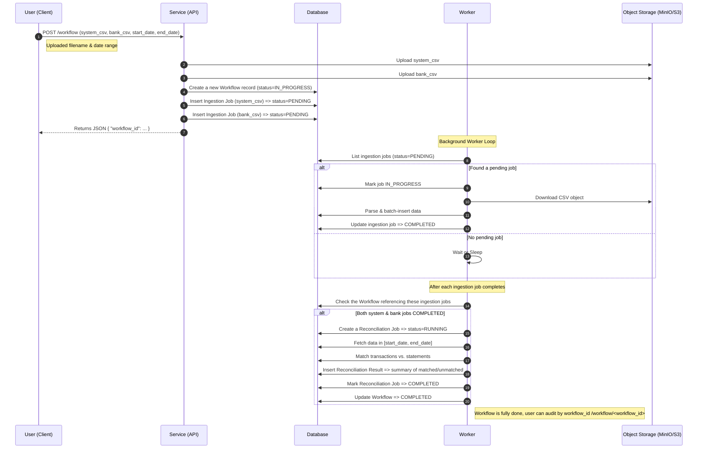

# Reconciliation Service
**Description:** Responsible in reconciliate system generated transaction with bank statements
# Assumption
1. Both system transactions and bank statements are provided as separate CSV files. 
2. Discrepancies only occur in amount.
3. User know the path of uploaded file, the upstream should be able to store csv somewhere in object storage. hence we dont create upload mechanism
4. Transaction and bank statement files is using generic format, but the code was designed to cater customization later
5. Data needs to be auditable

# Sequence diagram

# Architecture
## available endpoint
1. ``POST {baseURL}/reconciliation-service/v1/workflow`` starting reconciliation workfow
2. ``GET {baseURL}/reconciliation-service/v1/workflow/<workflow_id>`` get result summary

## Layering
This is the overview of this repository architecture layer

`cmd/tms/main` ↔ `internal/presenter` ↔ `internal/usecase` and `internal/model` ↔ `internal/infrastructure/` ↔ `Database/PubSub/APIs`

### Main
This folder is the entrypoint of this repository. Main initialize these things listed below:
* config
* logger
* migrator
* server

### Presenter
This section manages the presentation layer of this repository. We put console, migrator, and server code here. We also put API communication mechanism codes here (example: REST, RPC, GraphQL).

### Usecase and Model
Usecase and model contain business logic of this repository.

### Infrastructure
Infrasturcture layer contains infrastructure code needed for business logic purposes. This may include code such as initiating external API calls, SQL store, PubSub, etc.

# Environment Setup
This section will guide on how to setup this repository on your local machine.
## Initial Setup
### Initialization
Run this command to download external dependencies and download required package.
```
make init
```

### Docker
We are using docker to initialize our dependencies such as postgres, redis, etc. To run docker, use this command.
```
make deps-up
``` 

To turn off the dependencies from docker, use the command below.
```
make deps-down
```

## Running the Repo on Local
We have 2 ways to run the repo, using the manual reload and hot reload approach. **Please note that transaction-management-service require PUBSUB to run, so either you need to run "make deps-up" or have your own built-in PUBSUB image**.

To do manual approach, use this command.
```
make run
```
This will automatically trigger the `make compile` command to compile the binary.

To do hot reload approach, use this command.
```
make air-http
```
The config to run air is located in `.dev/http.air.toml`. You can change the config if needed on that toml file.

## Migrate
For local database, we can migrate the schema by using this.
```
make migrate
```
It will run `make compile` and execute the migrate command. **Make sure that the database connection on `config.yaml` is correct and can connect to your local database**.

### Generate Mock
For unit test purposes, we need to generate mock. To generate all required mock, use this.
```
make generate-mock
```

## Unit Test
To run all unit tests, you can use this command below.
```
make test
```

# Conduct Test
User expected to upload the file into storage first (minio), hence docker-compose.yaml provide minio as the storage
## sample request
### Start reconcile
#### Request
```
curl --location 'http://localhost:8080/reconciliation-service/v1/workflow' \
--header 'Content-Type: application/json' \
--header 'Authorization: Basic ZGV2OmZvb2Jhcg==' \
--data '{
  "system_transaction_file_path": "tx1.csv",
  "bank_statement_file_paths": [
    "bank_statements.csv",
    "bs1.csv"
  ],
  "start_date": "2025-01-01T00:00:00Z",
  "end_date": "2025-01-31T23:59:59Z"
}'
```
### Get result
#### Request
```
curl --location 'http://localhost:8080/reconciliation-service/v1/workflow/45c163be-706a-4abf-9110-747d31553f23' \
--header 'Authorization: Basic ZGV2OmZvb2Jhcg=='
```
#### Response
```
{
    "workflow_id": "45c163be-706a-4abf-9110-747d31553f23",
    "status": "COMPLETED",
    "start_date": "2025-01-01T00:00:00Z",
    "end_date": "2025-01-31T00:00:00Z",
    "reconciliation_summary": {
        "total_transactions_processed": 15,
        "total_matched_transactions": 4,
        "total_unmatched_transactions": 11,
        "unmatched_system_transactions": [
            {
                "TrxID": "EHEJNYRUGJ",
                "Amount": 1662.82,
                "Type": "Debit",
                "TransactionTime": "2025-01-03T07:32:27Z",
                "CreatedAt": "0001-01-01T00:00:00Z",
                "UpdatedAt": "0001-01-01T00:00:00Z"
            },
        ],
        "unmatched_bank_transactions_by_bank": {
            "BNI": [
                {
                    "UniqueID": "TX9999",
                    "Amount": 999.99,
                    "StatementDate": "2025-01-06T00:00:00Z",
                    "BankCode": "BNI",
                    "CreatedAt": "0001-01-01T00:00:00Z",
                    "UpdatedAt": "0001-01-01T00:00:00Z"
                }
            ]
        },
        "total_discrepancies": 400
    }
}
```